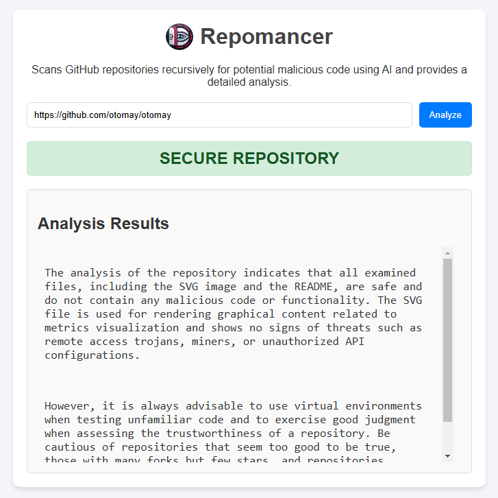

<p align="center">
  
</p>

# 🩻 REPOMANCER

<p align="center">
  
</p>

## 📝 Description

Sometimes it's easy to tell if a github repository is malicious: too much forks, no issues and PR section, no relevant commits... but sometimes isn't that easy.

**Repomancer** is a GitHub repository scanner that uses the AI to identify **malicious code** in repositories.

With this project, you can provide a GitHub repository URL and receive a detailed analysis of the code, highlighting potential **threats** such as **RATs**, **Trojans**, **miners**, and other dangerous code.

## ⚙️ Features

- **GitHub Repository Analysis**: Clones the repository and performs a recursive check of all code files.
- **Contextual Analysis**: Creates context from the repository’s description and README for more accurate diagnostics.
- **Malicious Code Identification**: Uses AI to detect malicious code patterns with a robust redundancy system and strong contextualization between files.
- **Detailed Reports**: Provides a conclusion based on the analysis results and highlights the **potential risks** identified.

## 🛠️ Self Hosting / Local Deploy with Docker Compose

The easiest way to run **Repomancer** is by using the ready-made Docker Compose image.

```yaml
version: "3.8"
services:
  app:
    image: ghcr.io/otomay/repomancer:latest
    container_name: repomancer
    ports:
      - "3000:3000"
    environment:
      - OPENAI_API_KEY=xxx
      - OPENAI_MODEL=gpt-4o-mini # gpt >4 recommended because of the maximum token length.
      - OPENAI_API_PARAMS= # Optional -> Use to pass additional parameters to the OpenAI API client
      - EXPOSE_BACKEND=false # Optional -> Use to expose the backend post route (/api/analyze). Useful for scripts with loop and schedulling.
      - UVICORN_WORKERS=1 # Optional -> Use to set the concurrency level of the Uvicorn server
```

## 🚀 Run Locally and Develop

### 1. Prerequisites

Make sure you have the following tools installed:

- **Python 3.9+**: To run the application backend.
- **Node.js** (optional): To run the frontend locally.
- **Git**: To clone repositories.

### 2. Running Locally

#### Step 1: Clone the Repository

1. Clone the repository with the command:
```
git clone https://github.com/otomay/repomancer.git
```
```
cd repomancer
```

---

#### Step 2: Prepare the Backend Environment

Install the backend dependencies with Python:

- Navigate to the backend folder:
```
cd backend/
```
- Install the dependencies:
```
pip install -r requirements.txt
```
- Run the backend:
```
uvicorn app.main:app --host 0.0.0.0 --port 8000
```

---

#### Step 3: Prepare the Frontend Environment

Open a new terminal in the repomancer folder and install the frontend dependencies:

- Navigate to the frontend folder:
```
cd frontend/
```
- Install dependencies with NPM:
```
npm install
```
- Start the frontend:
```
npm start
```

---

The application will be available at **[http://localhost:3000](http://localhost:3000)**. 
Just enter a GitHub repository URL to start the analysis. The system will download the repository and display the results.

## 🤝 How to Contribute

1. Fork the repository.
2. Create a new branch (e.g., `git checkout -b feature/new-feature`).
3. Make your changes and commit (e.g., `git commit -am 'Add new feature'`).
4. Push to the branch (e.g., `git push origin feature/new-feature`).
5. Open a **Pull Request**.

> If you are submitting a new feature, I would love if you could post a video of what it does.

## 📜 License

This project is licensed under the **MIT License**.

## 💭 Final Considerations

**Repomancer** was designed to be an efficient GitHub repository scanner for detecting malicious code. Feel free to contribute, improve, or expand the functionality to detect other types of threats!
